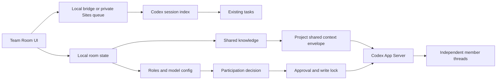

# Architecture

## 设计目标

Codex Team Room 把“项目”作为共享边界，把“成员”作为可配置执行者，把“历史任务”作为只读依据。公共房间状态不修改原始 Codex 会话。

## 当前实现

- `src/`：React 界面、成员配置、发言判断、本地状态和审批交互。
- `server/codexSessionIndex.mjs`：只读扫描本机 Codex 会话索引，并过滤内部上下文消息。
- `server/codexAppServerRuntime.mjs`：可替换的 App Server JSONL-RPC 适配层；把成员模型、推理强度、沙箱和一次性审批映射到独立 Codex 线程。
- `server/teamRoomRuntimeManager.mjs`：真实运行时、成员线程创建/恢复、房间与任务路由、事件回流、审批队列和服务端单写入锁。
- `server/sharedContext.mjs`：把项目知识、近期团队消息、成员名称和来源对话 ID 组装成版本化上下文信封。
- `server/viteCodexBridge.mjs`：仅绑定本机回环地址的索引、附件和真实运行时 HTTP 桥接层。
- `server/remotePairingBridge.mjs`：由电脑主动轮询所有者私人站点，领取任务、附件与一次性审批，并上传经过项目边界校验的成员交付物，不向公网开放电脑端口。
- `worker/`：私人 Sites 的任务、事件、索引请求、附件和设备认证 API；D1 保存队列元数据，R2 暂存用户主动上传的附件并持久保存成员明确交付的输出文件。

## 数据边界

房间配置和公共知识保存在浏览器 `localStorage`，并在私人站点/配对设备上通过 `owner_state` D1 记录同步。同步采用 compare-and-swap 修订号；过期写入返回冲突，由客户端拉取最新状态并提示用户重做冲突操作。Codex 会话保持在原路径，Team Room 不移动、不改写也不删除它们。打开历史对话时只返回有界数量的可见用户/助手消息；只有用户点击“挂入公共上下文”后，副本才会进入当前房间知识库。

每次发送生成唯一 `contextId`。所有本轮发言成员的独立 Codex thread 收到相同的项目知识和发送前团队消息，同时保留每条成员消息的 `agentId`、成员名称与 `sourceThreadId`。当前轮成员并行工作；它们的真实输出回流公共房间，并从下一轮开始成为其他成员可见的近期上下文。隐藏推理和系统上下文不会相互复制。

## 真实运行时与权限

运行时协议、安全映射和设置页显式启用流程已经落地，并通过 JSONL-RPC 协议级回归测试覆盖：

1. 每个成员映射一个独立 Codex thread，并携带各自的模型和推理配置。
2. 浏览器先根据每个项目成员的参与策略、职责关键词和直接提及决定是否创建真实 turn；未命中的成员不会消耗模型调用。
3. `只读分析` 与 `协调建议` 强制使用只读沙箱；`可申请写入` 使用工作区沙箱，但任何命令或文件变更仍进入一次性审批队列。关闭发送框执行开关时，本轮所有可写成员由服务端再次降级为只读。
4. 同一项目最多一个成员持有写入锁；完成、拒绝或超时后释放。
5. 公开共享的知识条目与成员私有推理分离，避免把隐藏系统上下文暴露给其他成员。
6. 真实运行时事件通过本地轮询或认证设备事件队列回流；私人站点自身没有启动本机进程的端点。
7. 图片和音频以 App Server 原生本地输入类型传递；其他文件以受控临时绝对路径交给本机 Codex。站点附件在任务领取后从 R2 删除，本机临时文件不进入仓库。
8. 成员回复保持纯文本源；前端只解析 `http(s)` 链接与远程栅格图片，不执行 HTML。项目文件必须以 Markdown 显式交付，经真实路径、项目根目录、敏感目录、扩展名和大小校验后才上传私人 R2；云端事件只携带不透明文件 ID 和安全元数据。

实现面向 Codex App Server 协议，不修改 Codex Desktop 安装目录，因此软件升级不会覆盖 Team Room。协议不兼容时发送失败并显示真实错误，不会回退到模拟回复。
