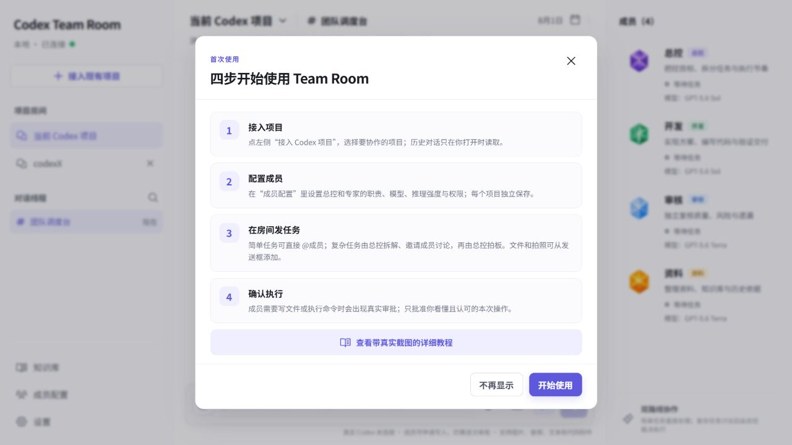
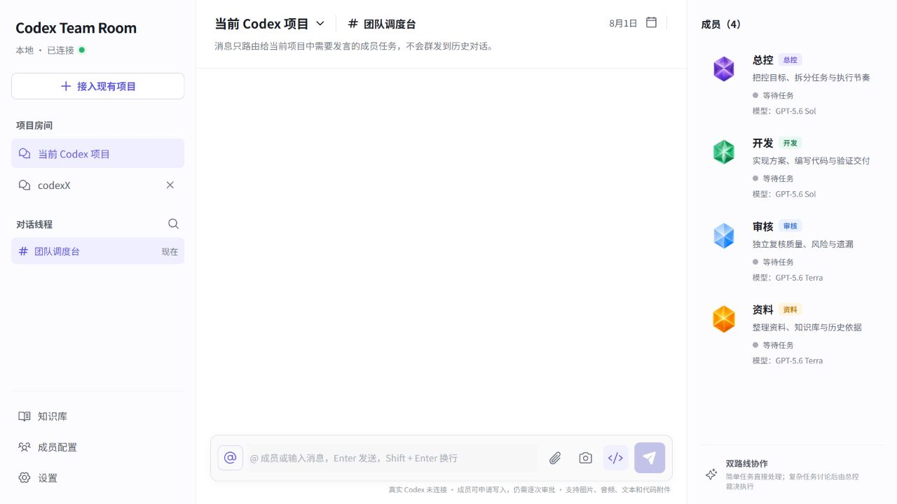
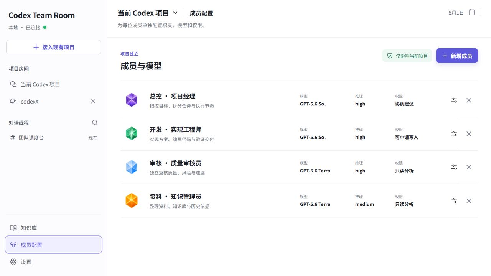
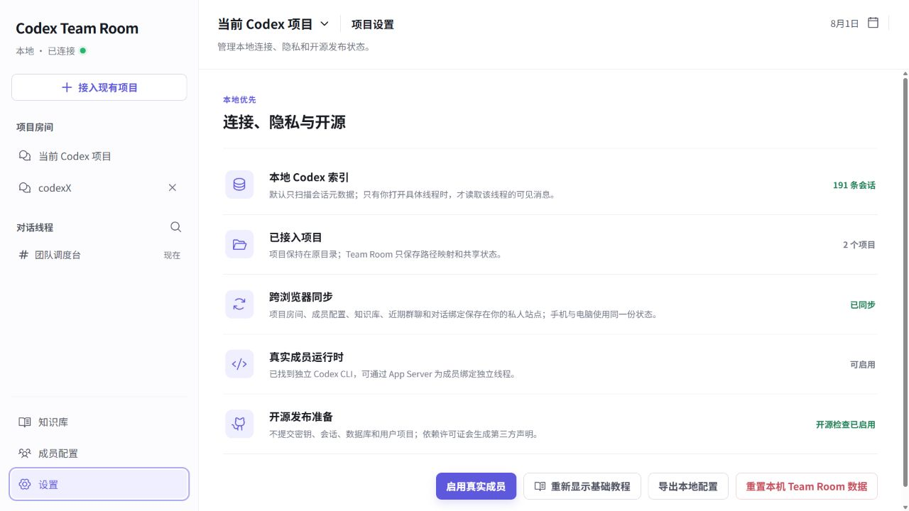

# Codex Team Room 图文使用教程

本教程使用项目真实页面截图，不使用 AI 生成图片。界面随版本更新可能略有变化，但按钮名称和安全边界保持一致。

## 1. 安装并打开

1. 下载或克隆仓库到最终使用目录，不要先安装后再移动整个文件夹。
2. 双击根目录的 `install-team-room.cmd`。安装器会检查 Node.js、官方 Codex CLI，按锁文件重建依赖，完成构建和安全检查，并启动本机页面。
3. 需要手机访问时，把根目录的 `CODEX_SETUP.md` 拖入 Codex；按提示创建只属于你的私人站点和配对。

选择“开始使用”会关闭本次教程；选择“不再显示”后，以后可在“设置”中重新打开。

## 2. 接入项目和历史对话

1. 点击左侧“接入 Codex 项目”。
2. 选择项目后，它会成为一个独立房间。查看历史只读取对话，不修改原对话。
3. 打开需要延续的历史对话，点击“挂入公共上下文”。已挂入的对话会有明确标记；之后成员收到的是当前房间的增量共享上下文，不会每次重发全部历史。

## 3. 配置成员

1. 进入“成员配置”，为当前项目添加总控、开发、审核、资料等成员。
2. 每位成员可配置独立 Codex 对话、模型、推理强度、职责、权限和可编辑提示词。
3. 简单任务可直接 `@成员`；复杂任务交给总控，由总控拆解、激活需要的成员讨论，再拍板和安排执行。
4. “只读分析”不能写项目；“可申请写入”仍需你对每次真实操作单独审批；总控只负责分析和调度。

## 4. 发消息、附件与审批

- 在底部发送框输入任务；回形针选择文件，相机按钮拍照或选图。
- 成员工作标志只由真实 Codex 事件驱动：收到、讨论中、执行中、回传中、完成不会按计时器猜测。
- 成员回复中的网页地址可点击；真实交付的图片和文件会显示预览或下载卡片。
- 命令或文件写入出现审批卡时，先看清操作、目标、影响和风险。拒绝不会执行；批准也只对本次请求有效。

## 5. 连接与重新显示教程

- 本地页面显示“真实 Codex 已连接”才能直接执行；切换房间时系统会安全切换运行时，存在审批或写入锁时不会强制抢占。
- 私人站点显示“本机在线”时会立即执行；电脑离线时任务保留在私人队列，开机并登录 Windows 后本机服务会自动恢复。
- 在“设置”点击“重新显示基础教程”，随时重新打开四步说明。

## 6. 移动目录或排障

- 项目移动到新目录后，再次双击 `install-team-room.cmd`。它会在新位置重建依赖并更新自动启动入口。
- 不要复制 `node_modules`、`.team-room`、别人的 `.openai/hosting.json` 或任何令牌。
- 安装器没有报告“安装完成”时不要继续配对；把第一条错误完整反馈到项目 Issue 即可，避免反复运行多套修复命令。
